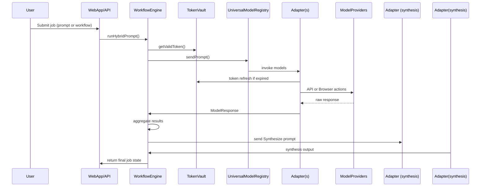

# Hybrid Thinking: Architecture Overview

## Core Concept Recap

Hybrid Thinking is an **intelligence orchestration platform** that executes staged workflows across multiple AI models, using synthesis as the primary transformation pattern. The system's key differentiator is its focus on **staged intelligence transformation** rather than just multi-model access.

The platform operates on a two-stage intelligence pattern:

1. **GENERATE (Divergent Intelligence)**: Execute identical prompts across multiple models to capture diverse perspectives.
2. **SYNTHESIZE (Convergent Intelligence)**: Process all Stage 1 outputs through synthesis prompts to create coherent results.

This approach enables universal model access through a combination of API-based, browser-based, and local models, all unified through a common adapter interface.

## Five Core Systems

### 1. UniversalModelRegistry

The UniversalModelRegistry abstracts every AI model into a common interface, allowing the Execution Engine to call them uniformly.

- **API Adapters**: Modules for OpenAI, Anthropic, Azure, Cohere, etc. that retrieve credentials from TokenVault, build provider-specific payloads, handle streaming/non-streaming, and normalize responses.
  
- **Browser Adapters**: Leverage the ExtensionCoordinator to proxy prompts/responses through user browser sessions for web-based models like ChatGPT, Gemini, Claude, etc.
  
- **Local Adapters**: Interface with models running locally through Ollama, LlamaCpp, or other frameworks.
  
- **Registry**: A configuration layer mapping `modelId` to adapter information, supporting dynamic lookup and versioning.

### 2. TokenVault & Credential Manager

The TokenVault securely stores, retrieves, and refreshes credentials for each user+provider combination.

- **Storage**: Uses encrypted database records to store API keys, OAuth tokens, and browser session tokens.
  
- **In-Memory State**: Manages refresh promises, failure counts, and circuit breaker states.
  
- **Refresh Logic**: Handles token expiry, refresh operations, and circuit breaking for failed authentication.

### 3. ExtensionCoordinator

The ExtensionCoordinator turns any web-based AI into a programmable model via a Chrome MV3 extension.

- **Content Scripts**: Site-specific scripts that locate input elements, inject prompts, monitor responses, and detect login state.
  
- **Background Script**: Maintains mapping between model IDs and browser tabs, manages WebSocket communication with the backend, and routes messages.
  
- **Session Health**: Monitors the health of browser sessions and detects when re-authentication is needed.

### 4. WorkflowEngine

The WorkflowEngine orchestrates staged intelligence workflows, managing the execution of prompts across models and the synthesis of results.

- **Core Data Structures**: Maintains job metadata, in-flight jobs, and execution context.
  
- **Primary Functions**: Handles hybrid prompt execution, model success/failure events, and synthesis operations.
  
- **Parallel vs. Sequential Execution**: Supports both parallel and sequential execution of generation steps.
  
- **Error Recovery & Fallback**: Implements retry and fallback mechanisms for failed model invocations.

### 5. ExecutionContext & TransportLayer

The ExecutionContext maintains unified state across job execution, while the TransportLayer provides multi-interface I/O.

- **ExecutionContext**: Manages context frames, variable bindings, provenance tracking, and multi-user isolation.
  
- **TransportLayer**: Supports Web (React + Redux + Socket.io), CLI (Node CLI tool), API (REST + Webhook), and Extension (Chrome MV3) interfaces.

## High-Level Data Flow Diagram

## Implementation Strategy & Phases

### Phase 1: Core Platform (Web-First)
- Enhanced WorkflowEngine with YAML workflow support
- UniversalModelRegistry with extension coordination
- Real-time web interface for workflow management

### Phase 2: Extension Universal Access
- Multi-model browser extension with session management
- Automated model detection and registration
- Robust DOM interaction and error recovery

### Phase 3: Multi-Interface Unification
- CLI as thin client to web engine API
- Programmatic API with webhook/callback support
- Cross-interface workflow portability

## Key Technology Choices & Design Principles

- **Backend**: TypeScript, Node.js, Express (or similar framework)
- **Database**: SQLite for MVP (can be migrated to Postgres later)
- **Browser Extension**: Chrome MV3
- **Web Interface**: React + Redux + Socket.io
- **Design Patterns**:
  - Modular adapter pattern for model access
  - Circuit breaker pattern for resilience
  - YAML-driven workflow specifications
- **Security**: AES-256-GCM encryption for token storage
